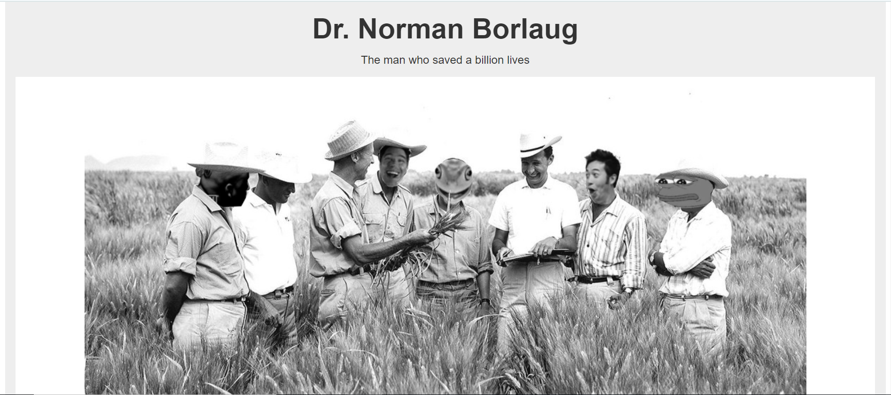

# tribute-page

This is a Tribute page project created to showcase a fictional web developer's skills and projects. This project demonstrates the use of HTML, and CSS to build a responsive and visually appealing portfolio website.

## Features

- Responsive design


## Live Demo



## Installation
To set up this project locally, follow these steps:

1. **Clone the repository**:
   ```bash
   git clone https://github.com/your-username/tribute-page.git
   ```
   Make sure to replace your-username with your actual GitHub username when cloning the repository.

2. **Navigate to the project directory**:
   ```bash
   cd tribute-page
   ```

3. **Open the `index.html` file in your browser**:
   ```bash
   open index.html
   ```
   
4. **View the source code:**
If you want to explore the source code, open the project in your preferred code editor (e.g., VSCode):
   ```bash
   code .
   ```


## Technologies Used

- HTML
- CSS

## Contributing
We welcome contributions to improve the Afghani Clothes website. If you have ideas for enhancements, notice any issues, or want to work on this project, please follow these steps:

1. **Fork the repository.**

2. **Create a new branch:**
   ```bash
   git checkout -b feature-name
   ```

3. **Make your changes and commit them:**
   ```bash
   git commit -m "Description of changes"
   ```

4. **Push to the branch:**
   ```bash
   git push origin feature-name
   ```

5. **Create a pull request.**
If you see a problem in the code or want to discuss potential improvements, feel free to open an issue or contact me directly.


## Author
For any questions, feedback, or support, please contact me at:
- LinkedIn: Still cannot access my LinkedIn account.
- Email: [Zohal Mirkhel] zohalmirkhel@gmail.com
- GitHub: [Zohal Mirkhel] https://github.com/ZohalMirkhel 